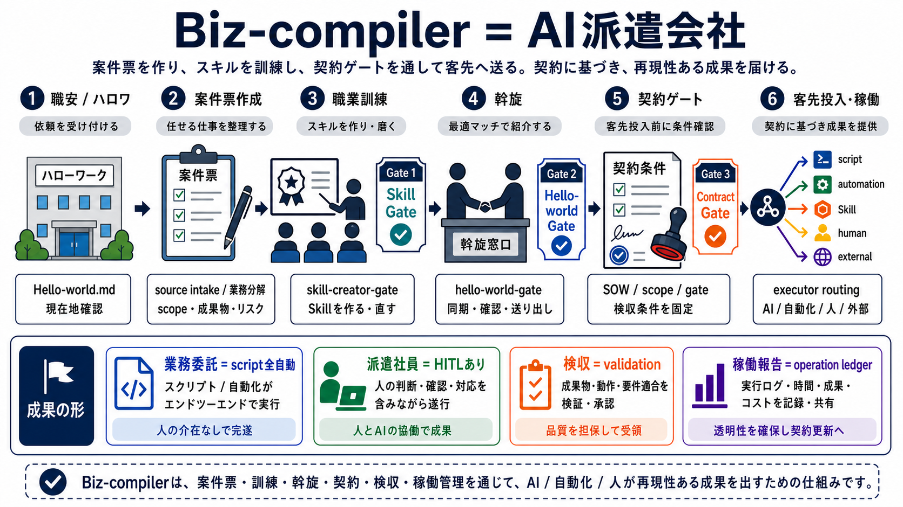
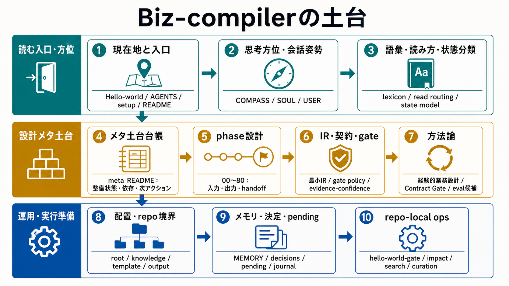

# Biz-compiler

## Images





Biz-compiler は、人間の業務をそのままAIへ丸投げする道具ではない。

業務をphaseごとに読み、IPO / gate / scope / executor / artifact / evidence へ分け、AI、automation、human、approvalへ再配置し、運用しながら検証・再コンパイルするための業務設計OSである。

## 雑に言うと

Biz-compiler は、AI業務委託の契約・検収・稼働管理をするための業務設計OSである。

華やかに言えばDXだが、実態はもっと地味である。最初のヒアリングは契約書作成そのものではなく、契約可能な状態にするための聞き取りである。何を委託するのか、何は委託しないのか、成果物は何か、入力は何か、誰が判断するのか、どこで止めるのか、scope外はどこからか、検収条件は何か、事故った時に誰が戻すのかを洗う。

さらに雑に言えば、Biz-compiler はAI派遣会社としても話せる。まず職安こと `Hello-world.md` で現在地を確認し、`COMPASS.md` を片手に、必要なSkillを職業訓練する。訓練済みのAI、Skill、automationを、contract、manifest、gate付きで業務へ投入し、稼働報告をledgerに残し、validationで検収する。

誰が何をどこまでやってよいか、どこで人間が止めるか、どう検収するかが見える。

## まず読む

このREADMEはGitHub上の入口であり、現在状態の正本ではない。

作業者は次を読む。

1. `AGENTS.md` - 作業規約と読み込み順
2. `Hello-world.md` - 現在地。構成とgateの正本
3. `SOUL.md` - agentの対話姿勢
4. `USER.md` - ユーザーの作業モデル
5. `COMPASS.md` - 思考の指向性 / heading
6. `knowledge/docs/lexicon.md` - 用語定義と概念境界
7. `MEMORY.md` - 常時参照メモリ

要求定義は常時読む対象ではない。要求全体確認、要求変更、要求定義との照合が必要な時だけ `knowledge/docs/requirements/` を読む。clone直後や環境を作り直した時は、別途 `setup.md` を読む。

## リポジトリの役割

このリポジトリは、Biz-compiler本体を作る場所である。

置くもの:

- 業務をコンパイルするためのphase contract、IR、schema、validator
- 同意ビュー、共通テンプレート、要求定義、設計判断
- 開発運用のrepo-local Skillとgate

置かないもの:

- 個別業務ごとの実行Skill、adapter、workflowの溜め込み
- `output/` 直下のサンプル業務フォルダ
- root直下の `docs/`、`pending/`、`journal/`、`scripts/` などの散らばった管理フォルダ

## 現在の基本構成

```text
template/   業務フォルダの原型
output/     業務ごとの成果物置き場。実業務作成まで空
knowledge/  確定知識、pending、journal、repo-local ops
```

`output/` は、業務を作る時だけ `output/Biz-001-業務名/` のように採番して作る。

## Setup

clone直後や環境を作り直した時は `setup.md` を読む。必要ツール、hook接続、生成物、knowledge-search index、確認コマンドをここへ置く。hook一覧は `knowledge/ops/registry.md` と `knowledge/ops/hooks/README.md` を正本にする。

## Gate

`Hello-world.md` は現在地を返すスモークテストである。

外から叩くコマンドは1つだけ。ハロワ更新、検査、必要なら日本語commit、GitHub push、post-checkまでこのgateで行う。

```powershell
.\knowledge\ops\skills\hello-world-gate\hello-world-gate.ps1 `
  -Type "運用" `
  -Subject "何を変えたか" `
  -Reason "なぜ必要だったか" `
  -Verified "何を確認したか" `
  -Risks "残っている注意点"
```

GitHubへ上げる依頼は、まず `git status --short --branch` で対象有無を見る。ローカル差分も未push commitもなく同期済みなら、gate本体は実行せず `対象ないよ。main と origin/main は同期済み。` と返す。対象がある場合だけ、ハロワ更新込みでこのgateを実行する。

## Status

このリポジトリは構想・要求定義・運用ルールを固めながら実装している開発作業場である。

最新状態は `Hello-world.md` を見る。
